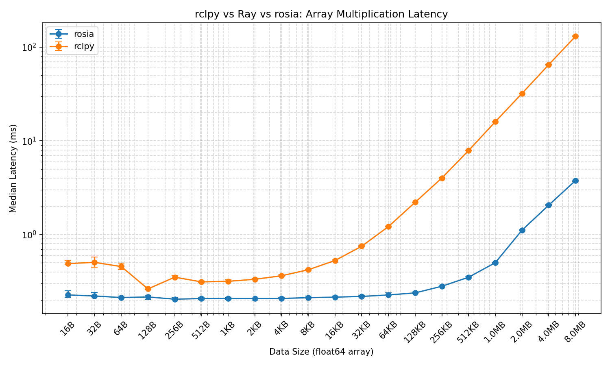

# Latency Benchmark

## Setup

This benchmark measures **round-trip latency** of array multiplication across three frameworks: Rosia, ROS 2 (rclpy), and Ray.

### Task

A sender node sends a `float64` numpy array and a scalar multiplier to a multiplier node, which multiplies the array element-wise and sends the result back. The latency is measured as the time from sending the array to receiving the result.

### Pipeline


```
Sender ──(array, scalar)──► Multiplier ──(result)──► Sender
```

- **Rosia**: Two nodes connected via input/output ports in a feedback loop.
- **ROS 2**: Two nodes communicating via pub/sub topics (`array_data` and `array_result`).
- **Ray**: A remote actor with a `multiply()` method called via `ray.get()`.

### Environment

- **Machine**: MacBook Pro with Apple M4 Pro chip
- **Container**: Docker (ARM64), based on `ros:humble`

### Parameters

- **Array sizes**: 2 to 1,048,576 elements (`2^1` to `2^20`), corresponding to 16 bytes to 8 MB of `float64` data.
- **Warmup**: 20 iterations per array size (discarded).
- **Measured iterations**: 20 per array size.
- **Metric**: Median latency in milliseconds.

The `% faster` column shows how much less time Rosia takes compared to ROS 2, calculated as `(ROS2_median - Rosia_median) / ROS2_median * 100`. For example, if ROS 2 takes 10ms and Rosia takes 2ms, the result is +80%, meaning Rosia
completes the same task in 80% less time.

## Results

On average, Rosia is **64.9%** faster than ROS 2.


